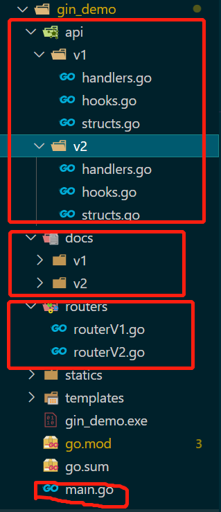
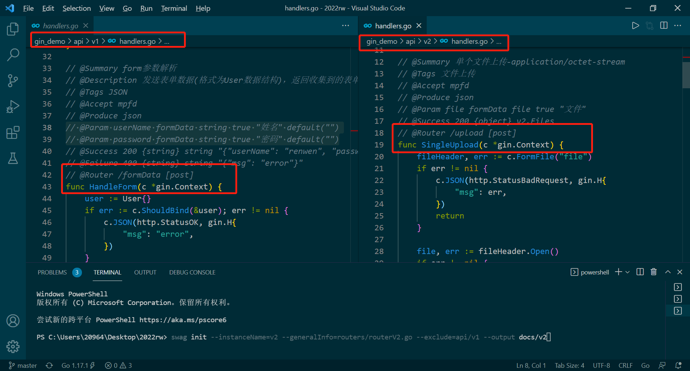
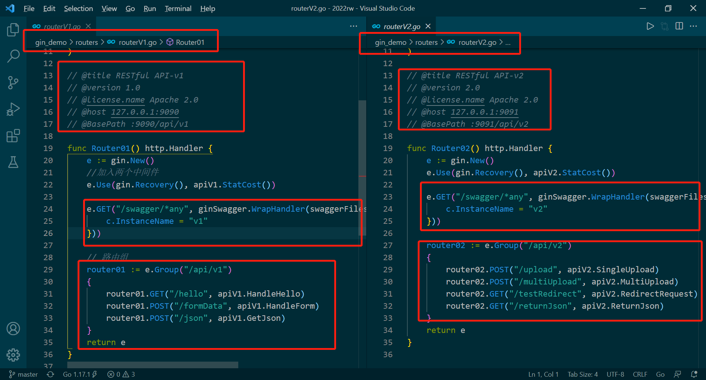
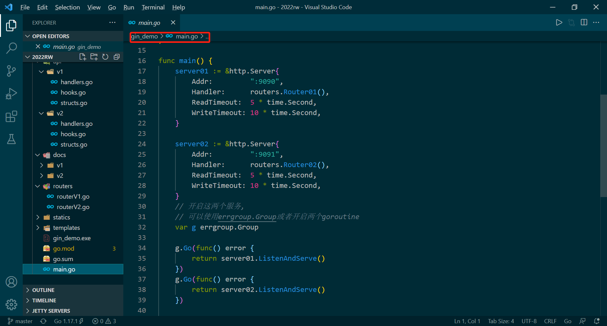
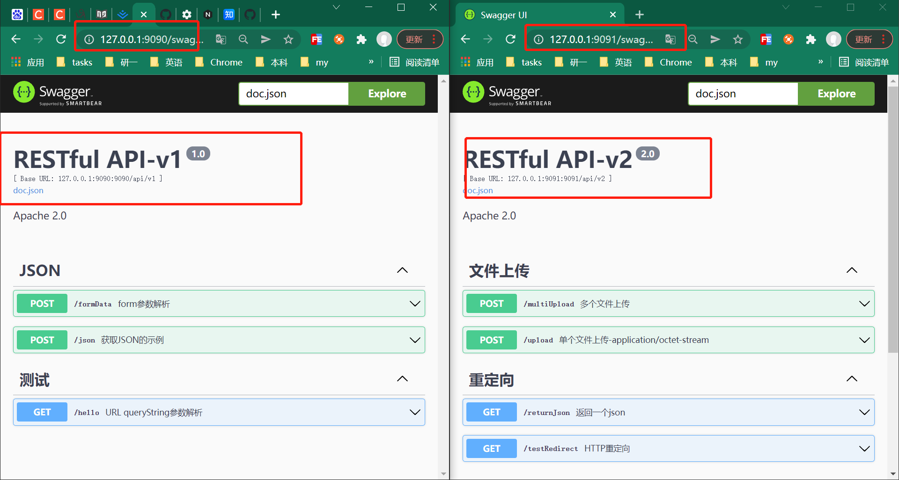

<<<<<<< HEAD
# gin_demo
单项目运行多个gin服务并开放不同的swagger文档
=======
swagger是一个web服务，是一个规范且完整的框架，可以生成、描述、调用和可视化RESTful风格的文档。

swaggo是一个工具，专门用于将golang注解自动转换成swagger2.0文档。

### 配置

1. 使用swaggo之前需要安全swag cli

   ```
   go get -u github.com/swaggo/swag/cmd/swag
   ```

2. 安装两个包

   ```
   go get github.com/swaggo/gin-swagger
   中间件
   go get github.com/swaggo/gin-swagger/swaggerFiles
   内置文件
   ```

3. 安装成功后，查看版本

   ```
   swag --version
   ```

   如果题是无法识别`swag`命令，查看一下是否将`$GOPATH\bin`加入环境变量中。

### 使用举例

> 下面例子未运行，简单举例，项目名称为gin_demo

1. 定义一个简单的api函数

   ```go
   func Helloworld(c *gin.Context)  {
       c.JSON(http.StatusOK, gin.H{"msg": "hello"})
   }
   //如果在别处需要引用该函数，记得将函数名大写哦，不然不会导出的
   ```

2. 接下来我们需要在这个函数上定义注解，以便swaggo将其转换成api文档

   ```go
   // @Summary this is a example
   // @Description 描述一下
   // @Tags 测试
   // @Accept json
   // @Produce json
   // @Success 200 {string} string "hello"
   // @Failure 400 {string} string "error"
   // @Router /hello [get]
   func Helloworld(c *gin.Context)  {
       c.JSON(http.StatusOK, gin.H{"msg": "hello"})
   }
   ```

3. 全部的函数代码

   ```go
   package main
   
   import (
      "github.com/gin-gonic/gin"
      _ "gin_demo/docs"
       
      "github.com/swaggo/gin-swagger/swaggerFiles"
      ginSwagger "github.com/swaggo/gin-swagger"
      "net/http"
   )
   // @Summary this is a example
   // @Description 描述一下
   // @Tags 测试
   // @Accept json
   // @Produce json
   // @Param name query string true "姓名"
   // @Success 200 {string} string "hello"
   // @Failure 400 {string} string "error"
   // @Router /hello [get]
   func Helloworld(c *gin.Context)  {
       c.JSON(http.StatusOK, gin.H{"name": "xiaoming"})
   }
   
   // @title RESTful API-v1
   // @version 1.0
   // @license.name Apache 2.0
   // @host 127.0.0.1:9090
   // @BasePath :9090/api/v1
   func main()  {
       r := gin.Default()
       r.GET("/swagger/*any", ginSwagger.WrapHandler(swaggerfiles.Handler))
       v1 := r.Group("/api/v1")
       {
           v1.GET("/hello", Helloworld)
       }
   
       r.Run(":9090")
   }
   ```

### 分析说明

#### API函数上的注解说明

- Tags：用来给API接口分组使用

- Accept：接收的参数类型，两种：表单`mpfd`和JSON`json`。

- Produce：返回的数据结构，一般都是json，其他的支持如下表

  | Mime Type                         | 声明                  |
  | :-------------------------------- | :-------------------- |
  | application/json                  | json                  |
  | text/xml                          | xml                   |
  | text/plain                        | plain                 |
  | html                              | html                  |
  | multipart/form-data               | mpfd                  |
  | application/x-www-form-urlencoded | x-www-form-urlencoded |
  | application/vnd.api+json          | json-api              |
  | application/x-json-stream         | json-stream           |
  | application/octet-stream          | octet-stream          |
  | image/png                         | png                   |
  | image/jpeg                        | jpeg                  |
  | image/gif                         | gif                   |

- Param：// @Param name query string true "姓名"

  |       参数       |                             含义                             |
  | :--------------: | :----------------------------------------------------------: |
  | 参数名，例如name |                  就是我们自己起的参数的名字                  |
  |     参数类型     | 主要有四种query、path、formData和body<br />query: 一般组合在url中，@Param name query string true "姓名"<br />path: 直接拼接在url中，@Param id path integer true "文件ID"<br />formData: 一般是POST、PUT方法所用，@Param userName formData string true "姓名" default("")<br />body: 当Accept时JSON格式时，我们使用该字段指定接收的JSON类型。@Param param body main.JSONParams true "需要上传的JSON" |
  |   参数数据类型   | string、interger(int, uint, uint32, uint64)、number(float32)和boolean(bool) |
  |     是否必须     | 表明该参数是否是必须需要的，必须的在文档中会黑体标出，测试时必须填写。 |
  |     参数描述     |                      就是参数的一些说明                      |
  |     其他属性     | 除了上面这些属性外，我们还可以为该参数填写一些额外的属性，如枚举，默认值，值范围等。 |

- Success

  指成功响应的数据

  > // @Success `1.HTTP响应码` `{2.响应参数类型}` `3.响应数据类型` `4.其他描述`

  1.响应码：200、400、500等

  2.响应参数类型/3.响应数据类型，可以是自定义类型`包名.模型`

- Failure，同Success

- Router：指定路由和http方法，`@Router /path/to/handle [HTTP方法]`

#### 路由函数上的注解说明

```
// @title RESTful API-v1
// @version 1.0
// @license.name Apache 2.0
// @host 127.0.0.1:9090
// @BasePath :9090/api/v1
```

- titile：文档标题
- version：版本
- license.name：必须填写
- host：IP
- BasePath：基础路径

### 运行

```
swag init
go build
./gin_demo.exe
```

### 单项目运行多个gin服务，同时开放不同的swagger文档

#### 分析

首先官方是给了gin多服务的示例的。

```go
package main

import (
	"log"
	"net/http"
	"time"

	"github.com/gin-gonic/gin"
	"golang.org/x/sync/errgroup"
)

var (
	g errgroup.Group
)

func router01() http.Handler {
	e := gin.New()
	e.Use(gin.Recovery())
	e.GET("/", func(c *gin.Context) {
		c.JSON(
			http.StatusOK,
			gin.H{
				"code":  http.StatusOK,
				"error": "Welcome server 01",
			},
		)
	})

	return e
}

func router02() http.Handler {
	e := gin.New()
	e.Use(gin.Recovery())
	e.GET("/", func(c *gin.Context) {
		c.JSON(
			http.StatusOK,
			gin.H{
				"code":  http.StatusOK,
				"error": "Welcome server 02",
			},
		)
	})

	return e
}

func main() {
	server01 := &http.Server{
		Addr:         ":8080",
		Handler:      router01(),
		ReadTimeout:  5 * time.Second,
		WriteTimeout: 10 * time.Second,
	}

	server02 := &http.Server{
		Addr:         ":8081",
		Handler:      router02(),
		ReadTimeout:  5 * time.Second,
		WriteTimeout: 10 * time.Second,
	}
	//这里也可以使用两个goroutine开启多个服务
	g.Go(func() error {
		return server01.ListenAndServe()
	})

	g.Go(func() error {
		return server02.ListenAndServe()
	})

	if err := g.Wait(); err != nil {
		log.Fatal(err)
	}
}
```

多服务可以了，接下来就是生成不同的文档，其实swag-cli提供了很多参数来帮助我们实现。

```
swag init -h
NAME:
   swag init - Create docs.go

USAGE:
   swag init [command options] [arguments...]

OPTIONS:
   --generalInfo value, -g value          API通用信息所在的go源文件路径，如果是相对路径则基于API解析目录 (默认: "main.go")
   --dir value, -d value                  API解析目录 (默认: "./")
   --exclude value                        解析扫描时排除的目录，多个目录可用逗号分隔（默认：空）
   --propertyStrategy value, -p value     结构体字段命名规则，三种：snakecase,camelcase,pascalcase (默认: "camelcase")
   --output value, -o value               文件(swagger.json, swagger.yaml and doc.go)输出目录 (默认: "./docs")
   --parseVendor                          是否解析vendor目录里的go源文件，默认不
   --parseDependency                      是否解析依赖目录中的go源文件，默认不
   --markdownFiles value, --md value      指定API的描述信息所使用的markdown文件所在的目录
   --generatedTime                        是否输出时间到输出文件docs.go的顶部，默认是
   --codeExampleFiles value, --cef value  解析包含用于 x-codeSamples 扩展的代码示例文件的文件夹，默认禁用
   --parseInternal                        解析 internal 包中的go文件，默认禁用
   --parseDepth value                     依赖解析深度 (默认: 100)
   --instanceName value                   设置文档实例名 (默认: "swagger")
```

我们可以通过`--instanceName`来指定生成文档的名称，通过`-generalInfo`来指定编写的路由函数，通过`--exclude`来指定解析的函数路径，通过`--output`来指定生成的文档路径

#### 举例



`api/v1`/`api/v2` `handler.go`中存放需要解析的函数。

`docs/v1`/`docs/v2` 存放生成的swagger文档

`routers`存放路由函数

`main`中开启服务。







**启动服务**

```
//需要注意的时，--exclude时除了哪个目录不解析，因此我们在执行v1的时候，不解析的应该是v2
swag init --instanceName=v1 --generalInfo=routers/routerV1.go --exclude=api/v2 --output docs/v1

swag init --instanceName=v2 --generalInfo=routers/routerV2.go --exclude=api/v1 --output docs/v2

go build

./gin_demo.exe
```



地址为：

http://127.0.0.1:9090/swagger/index.html

http://127.0.0.1:9091/swagger/index.html

>>>>>>> b348f20 (first commit)
